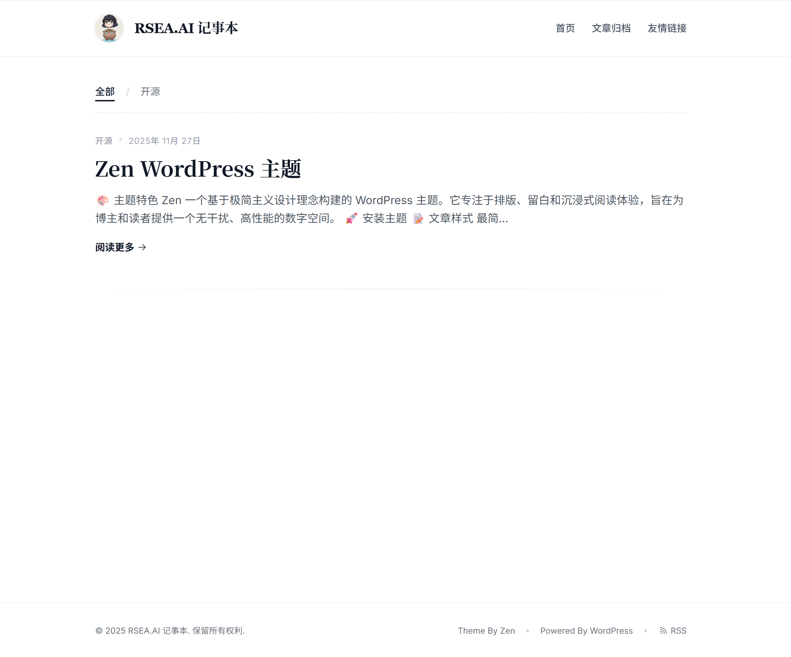
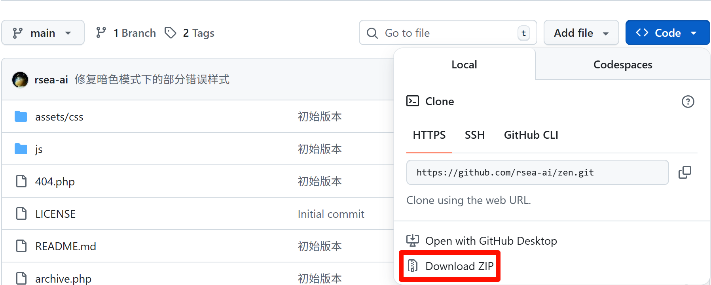

#  Zen WordPress Theme

## 🎨 主题特色

Zen 一个基于极简主义设计理念构建的 WordPress 主题。它专注于排版、留白和沉浸式阅读体验，旨在为博主和读者提供一个无干扰、高性能的数字空间。

* 响应式设计，操作系统自动亮暗色根据
* 集成 highlight.js，自动识别代码语言，支持暗黑模式配色。
* 阅读进度与文章页右侧自动生成悬浮目录
* 媒体美化，优化嵌入的 YouTube/Vimeo 视频样式，音频文件，文件下载样式。

## 🚀 安装主题

首先下载 Zen 主题的压缩包，如图所示

1. 上传主题：在后台 外观 -> 主题 -> 安装主题，上传压缩包。
2. 启用主题：在后台 外观 -> 主题 中启用 Zen。
3. 配置菜单：
    * 在外观 -> 菜单 中创建一个菜单，显示位置勾选 Primary Menu。
    * 建议添加“首页”、“归档”、“友链”等页面。
4. 页面设置：
    * 新建页面，标题为“归档”，右侧模板选择 Archives Template。
    * 新建页面，标题为“友链”，右侧模板选择 Links Template。
5. 添加友链：
    * 主题已自动开启“链接 (Links)”管理器。在后台添加链接，设置名称、Web地址、描述和图像地址即可。

## 开源协议

GPL V3.0